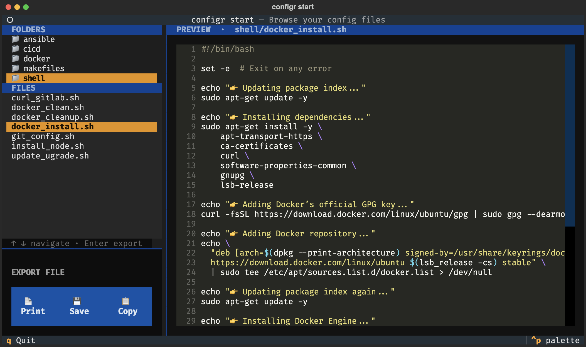

> Configr at your fingertips, one command to rule them all.


# configr-cli 


<!-- badges: start -->

<!-- badges: end -->

**configr-cli** is a command-line tool to interact with code snippets and configuration files (`Makefile`, `.gitlab-ci.yml`, etc.). After the installation run `configr start`: It gives you a user interface in the shell to explore, copy, and save files and code snippets. 

A collection of code snippets for QA 1 is available from a local GitLab repository called [**configr**](https://edgar-treischl.pages.gitlab.lrz.de/configr/). After configuring the CLI, you can just browse those files (or use your own repo) via the shell. 

```shell
# Open the UI via ...
configr start
```





<br/>

Alternatively, use `configr fetch` to fetch files from the GitLab API directly.